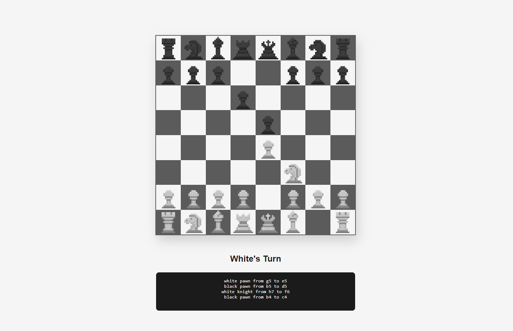

# Javascript-2D-Chess-Game
2D Chess game made with Vanilla JS

## Features
1. Everything that a normal chess game has, except no AI yet.
2. Responsive Layout

### Preview Image

[Click Here](https://javascript-2d-chess.glitch.me) to preview the project!

### Reference
Reference for 2D chess piece assets can be found [Here!](https://silverm.itch.io/chess-pixel-art)